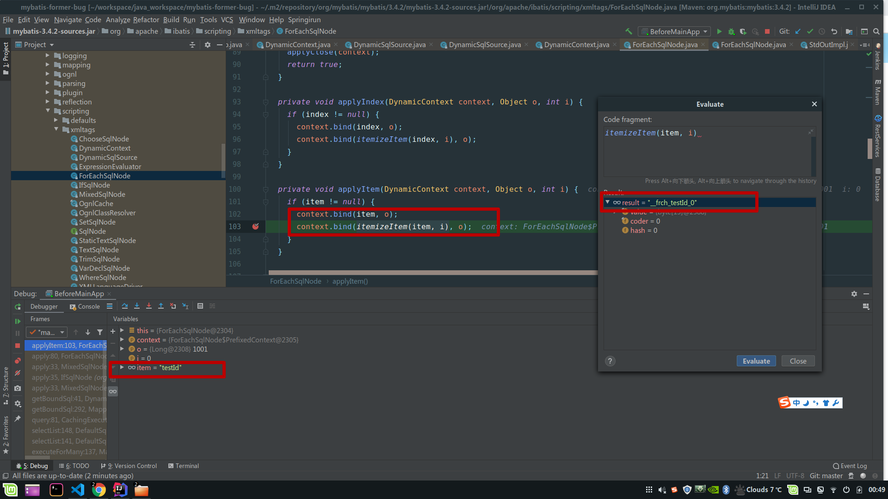

# mybaits 远古 BUG 踩坑记

## BUG 复现

同样的代码，一个 mybatis 版本时 3.4.2，一个是 5.4.2

mapper:

```xml
<select id="batchSelectTest1" resultType="java.util.Map">
    select test_id from test_table where 1 = 1
    <if test="testIdList != null and testIdList.size > 0">
        and test_id in
        <foreach collection="testIdList" item="testId" separator="," open="(" close=")">
            #{testId}
        </foreach>
    </if>
    <if test="testId != null">
        and test_id = #{testId}
    </if>
</select>
```

service:

```java
TestParam testParam = new TestParam();
testParam.setTestIdList(Arrays.asList(1001L, 2002L, 3003L));
testMapper.batchSelectTest1(testParam);
```

### 运行结果

#### mybatis-former-bug-after

mybatis 版本 3.5.3

运行结果正确

```log
==> Preparing: select test_id from test_table where 1 = 1 and test_id in ( ? , ? , ? )
==> Parameters: 1001(Long), 2002(Long), 3003(Long)
```

#### mybatis-former-bug-before

mybatis 版本 3.4.2

运行结果错误

```log
==> Preparing: select test_id from test_table where 1 = 1 and test_id in ( ? , ? , ? ) and test_id = ?
==> Parameters: 1001(Long), 2002(Long), 3003(Long), 3003(Long)
```

### 问题

3.4.2 版本没有设置 testId 的值，为什么最后 testId = 3003 了？

## 问题分析

在 mybatis `foreach` 标签中 `item` 的名称也为 `testId`，在 `foreach`迭代过程中将 `testId` 设置为了 `testIds` 的最后一位

### mybatis 源码分析

#### 动态 SQL 模板

```sql
 select test_id from test_table where 1 = 1
<if test="testIdList != null and testIdList.size > 0">
    and test_id in
    <foreach collection="testIdList" item="testId" separator="," open="(" close=")">
        #{testId}
    </foreach>
</if>
<if test="testId != null">
    and test_id = #{testId}
</if>
```

#### 静态 SQL 模板

```sql
select test_id from test_table where 1 = 1
    and test_id in
        (
        #{__frch_testId_0}
        ,
        #{__frch_testId_1}
        ,
        #{__frch_testId_2}
        )
    and test_id = #{testId}
```

mybatis 用 org.apache.ibatis.scripting.xmltags.DynamicContext 将动态 SQL 转换为静态 SQL

其中有两个重要的属性

```java
private final ContextMap bindings;
private final StringBuilder sqlBuilder = new StringBuilder();
```

`sqlBuilder` 为转换后的静态 SQL 模板。

`bindings` 用来保存参数上下文，某些标签在解析时会向 bindings 中写值，如 `bind`标签和 `foreach`标签。

### 3.5.3 版本的 DynamicContext


### 3.4.2 版本的 DynamicContext


DynamicContext 3.4.2 解析完成后生成的 bindings 比 3.5.3 多了个 `testId`，显然这个 `testId` 是多出来的，具体什么时候写入的呢？继续 DEBUG。

DUBUG 找到用来解析 foreach 标签的类 org.apache.ibatis.scripting.xmltags.ForEachSqlNode

在它的 apply 方法中:




apply 方法会将

```xml
<foreach collection="testIdList" item="testId" separator="," open="(" close=")">
    #{testId}
</foreach>
```

替换为:

```sql
 and test_id in
    (
    #{__frch_testId_0}
    ,
    #{__frch_testId_1}
    ,
    #{__frch_testId_2}
    )
```

并向 bindings 中写入:

- `__frch_testId_0`
- `__frch_testId_1`
- `__frch_testId_2`

同时写入 testId(item)的值。

为什么要写入 testId(item)的值？

用于支持 foreach 包裹内容中 OGNL 表达式中包含 testId 的语句解析。
比如:

```xml
<foreach collection="testIdList" item="testId" separator="," open="(" close=")">
    <if test="testId != null">
        #{testId}
    </if>
</foreach>
```

testId != null 中的即为 OGNL 表达式。

### 问题原因

mybatis 3.4.2 版本在解析 `foreach` 标签时重新设置了 item(testId)的值，在 foreach 结束后未及时清除。

## BUG 影响范围

如果 mapper testId 和 testIds 交换顺序:

```xml
<select id="batchSelectTest1" resultType="java.util.Map">
    select test_id from test_table where 1 = 1
     <if test="testId != null">
        and test_id = #{testId}
    </if>
    <if test="testIdList != null and testIdList.size > 0">
        and test_id in
        <foreach collection="testIdList" item="testId" separator="," open="(" close=")">
            #{testId}
        </foreach>
    </if>
</select>
```

使用过程中只要不同时设置 testId 和 testIds 不会有问题

原因:
if test 在 foreach 之前运行，运行 if test 时没有 testId，最终的模板就不会有`test_id = #{testId}`，最终的静态模板不解析 testId。

如果同时设置了 testId 和 testIds，在解析 foreach 标签时，bindings 中的 testId 值会被修改为 testIds 的最后一位。

...我就很不幸，属于把 testId 写在了 testIds 下面的那种，踩了一脚大坑。

### BUG 修复


修复版本: 3.4.5

修复时间: 2017 年 5 月 25 日

发布时间: 2017 年 8 月 20 日

在 apply for 循环结束后将 item 个 index 暴力移除了

在 BUG 修复后同时设置 testId 和 testIds，testId 会不会在 bindings 中变成 null?

答案是不会:
bingdings 中有一个用于存放原始参数的属性\_parameter

